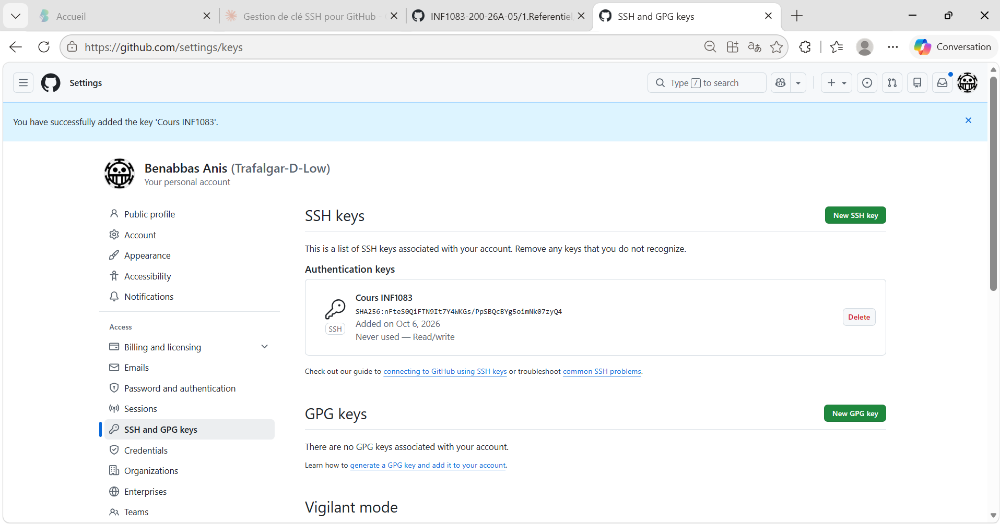

# 300150477 - Laboratoire 1 : IDE, Git et SSH

## Objectif

Configurer Git et SSH sur Windows et utiliser GitHub pour soumettre mon travail.

## Environnement

- Système : Windows
- Terminal : CMD
- Compte GitHub : Anis Benabbas

## 1. Git

J'ai cloné le dépôt du cours, créé mon répertoire `300150477`, configuré Git et créé mon premier commit.

```cmd
mkdir Developer
cd Developer
git clone https://github.com/CollegeBoreal/INF1083-200-26A-05.git
cd INF1083-200-26A-05\1.Referentiel\1.IDE
mkdir 300150477
git add 300150477
git commit --message ":star: Mon premier commentaire"
```


##2. SSH

J'ai créé une clé SSH avec ssh-keygen, configuré le fichier config et ajouté ma clé publique à mon compte GitHub.

```cmd
ssh-keygen -t ed25519 -C "300150477@monboreal.ca"
ssh -T git@github.com
```



##3. Dépôt SSH

J'ai configuré le dépôt du cours pour utiliser SSH.

```cmd
git remote set-url origin git@github.com:CollegeBoreal/INF1083-200-26A-05.git
git remote --verbose
git pull --no-edit
git push
```

## Conclusion

La configuration de Git, GitHub et SSH est maintenant terminée. Je peux utiliser SSH pour communiquer avec le dépôt GitHub du cours.
