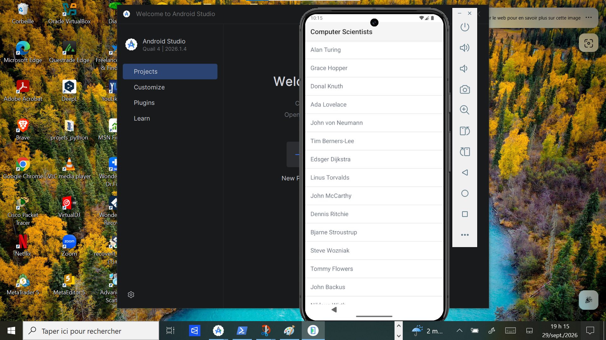
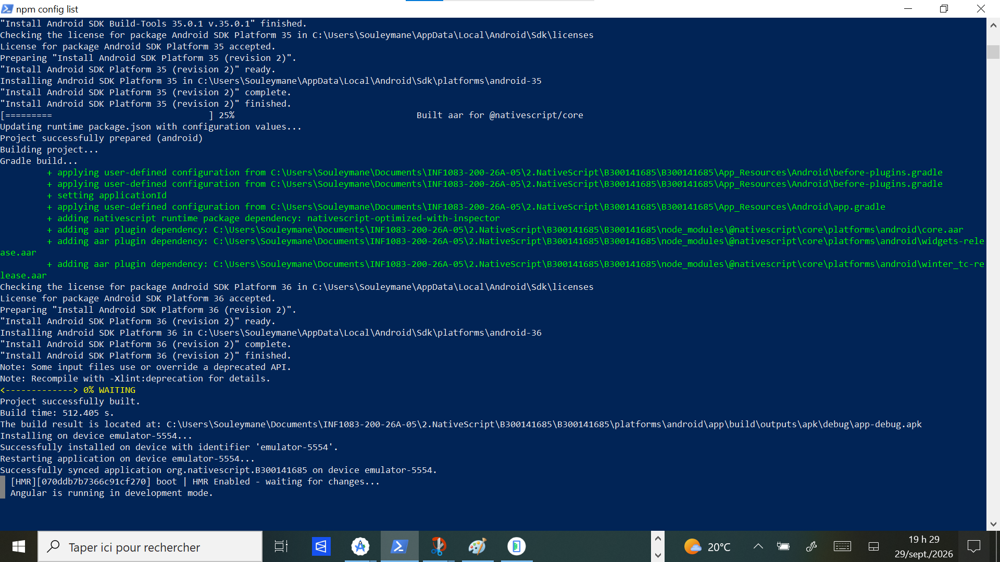

# B300141685 - Première application NativeScript

## Ce que j'ai fait
1. Installation de Node.js, NativeScript CLI, JDK 17 et Android Studio
2. Configuration de ANDROID_HOME et création de l'émulateur Pixel 8 (API 35)
3. Création du projet avec `ns create B300141685` (Angular, Hello World)
4. Lancement avec `ns run android`

## Application dans l'émulateur

## Résultat dans PowerShell
