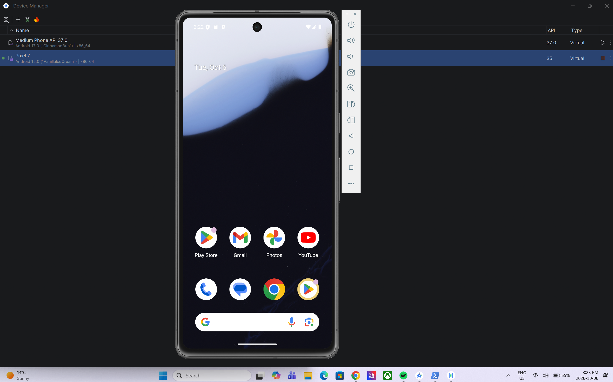
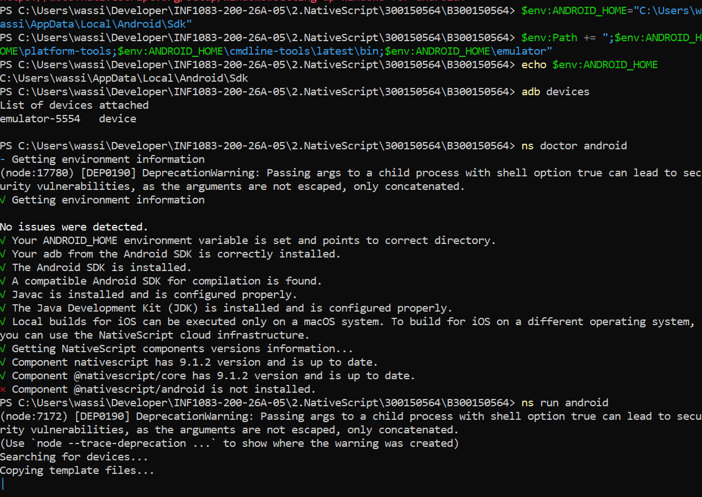
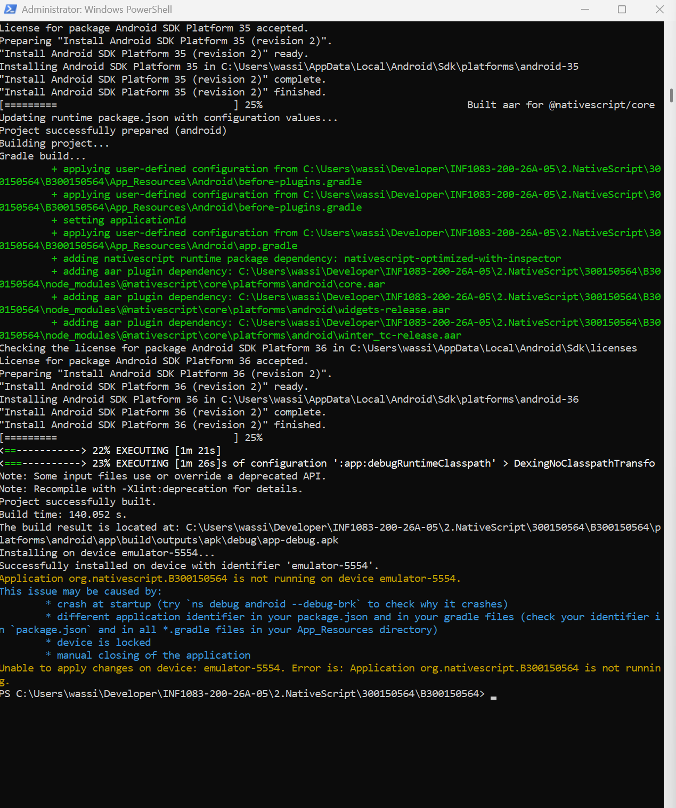
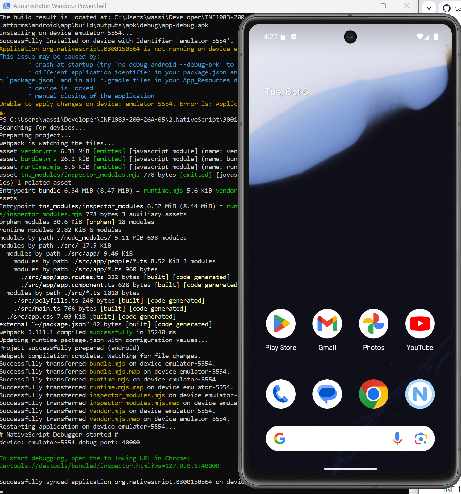

# 📱 NativeScript — INF1083

**Étudiant :** Ouassim Ahmed Benamira  
**Matricule :** 300150564  
**Programme :** TSIQ — Techniques des systèmes informatiques  
**Cours :** INF1083 — Développement d'applications  

---

## 🎯 Objectif

L'objectif de ce laboratoire est de créer et exécuter une application **NativeScript avec Angular** sur un émulateur Android.

Le projet créé est :

```text
B300150564
```

---

## 🛠️ Environnement

Pour réaliser le laboratoire, j'ai utilisé :

- 🟢 Node.js et npm
- 🚀 NativeScript CLI
- ☕ Java JDK 17
- 🤖 Android SDK
- 📱 Android Studio
- 📲 Émulateur Google Pixel 7 — Android 15 / API 35

---

## 📱 Configuration de l'émulateur

Un émulateur **Google Pixel 7** avec **Android 15 (API 35)** a été créé dans Android Studio.

<p align="center">
  
</p>

---

## 🔗 Vérification ADB et NativeScript

La connexion avec l'émulateur a été vérifiée avec :

```powershell
adb devices
```

Résultat :

```text
emulator-5554    device
```

L'environnement NativeScript a ensuite été vérifié avec :

```powershell
ns doctor android
```

Cette commande permet de vérifier le SDK Android, ADB, Java et les composants NativeScript.

<p align="center">
  
</p>

---

## 🚀 Compilation du projet

Le projet NativeScript a été lancé avec :

```powershell
ns run android
```

La compilation a réussi et l'application a été installée sur l'émulateur :

```text
Project successfully built.
Successfully installed on device with identifier 'emulator-5554'.
```

<p align="center">
  
</p>

---

## 🐞 Test en mode Debug

Pour vérifier l'exécution de l'application, j'ai utilisé :

```powershell
ns debug android --debug-brk
```

NativeScript a ensuite synchronisé le projet avec l'émulateur Android.

<p align="center">
  
</p>

---

## ⚠️ Problème rencontré

Au début, la compilation utilisait **Java 8**, qui était trop ancien pour Gradle.

J'ai installé **JDK 17** puis configuré :

```powershell
$env:JAVA_HOME="C:\Program Files\Eclipse Adoptium\jdk-17.0.17.10-hotspot"
```

Après cette modification, Java 17 a été correctement détecté et la compilation Android a fonctionné.

---

## ✅ Résultat

Le projet **B300150564** a été :

- ✅ créé avec NativeScript et Angular
- ✅ compilé avec Gradle
- ✅ connecté à l'émulateur avec ADB
- ✅ installé sur un Pixel 7 virtuel
- ✅ synchronisé avec NativeScript

---

## 📝 Conclusion

Ce laboratoire m'a permis de configurer un environnement de développement **NativeScript pour Android**, de créer un projet Angular et de comprendre l'utilisation de **ADB, Android SDK, Java JDK et Gradle** pour compiler et tester une application mobile.

---

<p align="center">
  <b>📱 INF1083 — NativeScript | 300150564</b>
</p>
