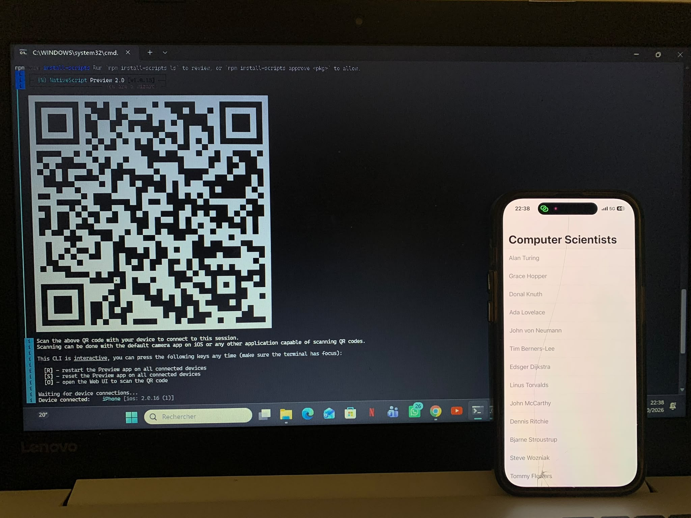

# B300156187

## Ce que j'ai fait

### 1. Installation

- Node.js v24.21.0 et npm
- NativeScript CLI 9.1.1 (installée globalement via npm)
- VS Code avec l'extension officielle NativeScript

### 2. Configuration de l'environnement de test

- L'émulateur Android est inutilisable sur ce PC (plantage systématique de l'AVD au démarrage, incompatibilité au niveau de l'hyperviseur Windows)
- Tests effectués sur un iPhone réel avec NativeScript Preview : application Preview installée sur l'iPhone, Node.js autorisé dans le pare-feu Windows
- Commande utilisée : `ns preview --no-hmr` (l'option `--no-hmr` contourne une erreur de génération webpack causée par l'apostrophe dans le chemin du dossier)

### 3. Création du projet

- `ns create B300156187` avec Angular et le template Hello World

### 4. Lancement

- `ns preview --no-hmr` : QR code affiché dans le terminal, scanné avec l'appareil photo de l'iPhone, application exécutée dans NativeScript Preview

## Laboratoire NativeScript — INF1083

Ce projet est dans le cadre du laboratoire du cours INF1083 – Développement d'applications mobiles, session Automne 2026. L'objectif du laboratoire était de mettre en place un environnement complet de développement mobile avec NativeScript, puis de créer, compiler et exécuter une première application.

Le travail a commencé par l'installation de tous les outils nécessaires : Node.js version 24.21.0 et la NativeScript CLI version 9.1.1 installée globalement via npm. VS Code a ensuite été configuré comme éditeur avec l'extension officielle NativeScript.

L'émulateur Android s'est révélé inutilisable sur ce PC (plantage de l'AVD dès le démarrage, lié à l'hyperviseur), donc l'application a été testée sur un iPhone réel grâce à NativeScript Preview : après avoir autorisé Node.js dans le pare-feu Windows, la commande `ns preview --no-hmr` affiche un QR code dans le terminal, scanné avec l'appareil photo de l'iPhone, et l'application s'exécute dans l'application Preview. L'option `--no-hmr` est nécessaire car l'apostrophe dans le chemin du dossier casse la génération de code HMR de webpack ; les modifications enregistrées provoquent alors un redémarrage de l'application au lieu d'un remplacement à chaud.

Le projet lui-même a été généré avec la commande `ns create B300156187`, en choisissant le cadriciel Angular et le modèle de démarrage Hello World.

Pour relancer le projet, il suffit de disposer de Node.js et de la NativeScript CLI correctement installés, puis d'exécuter la commande `ns preview --no-hmr` depuis le dossier du projet et de scanner le QR code avec l'iPhone. Une photo de l'application en cours d'exécution sur l'iPhone est disponible dans le dossier images.

